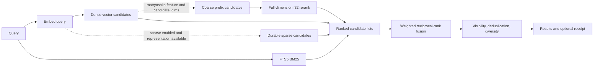
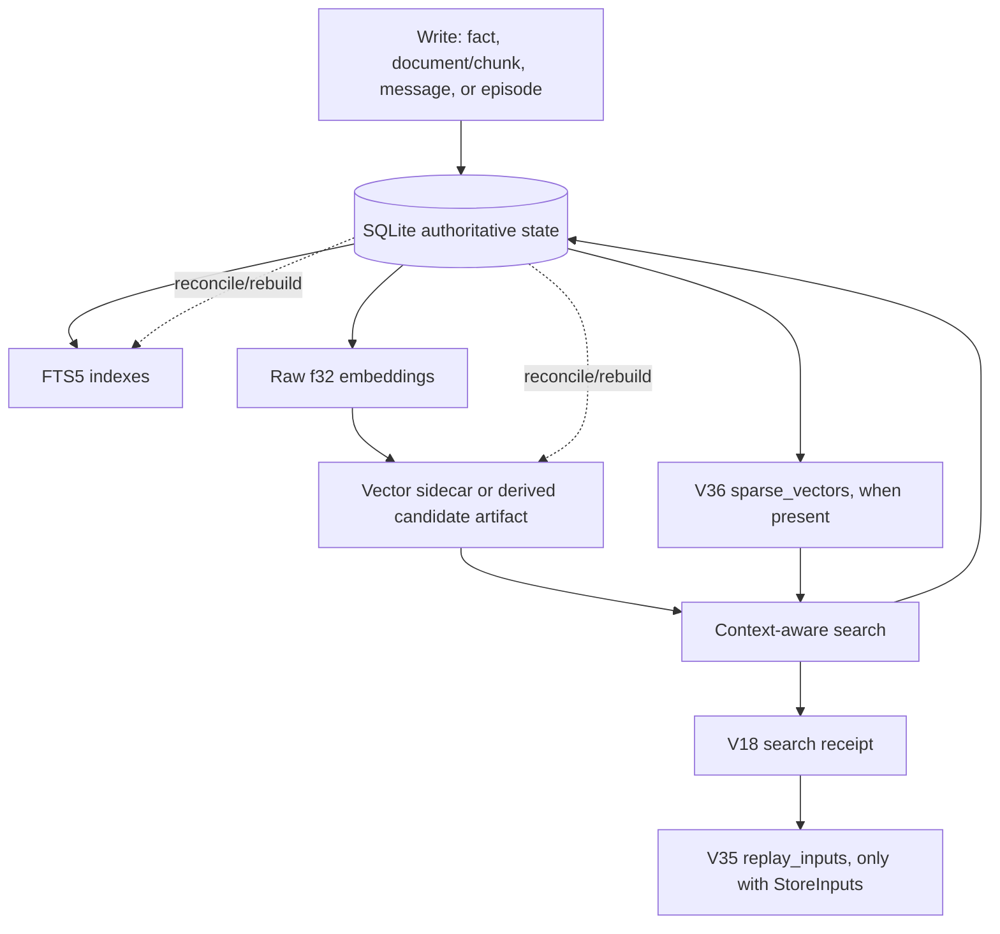

# semantic-memory

`semantic-memory` is a local-first Rust library for durable hybrid retrieval. SQLite is the authoritative store for facts, documents and chunks, conversations, episodes, embeddings, search receipts, and optional sparse representations. Vector indexes and derived vector artifacts accelerate retrieval; they do not become the source of truth and can be reconciled from SQLite.

The normal retrieval API searches facts, document chunks, and episodes. Conversation search is available separately, or messages can be selected explicitly with `SearchSourceType::Messages`.

## Production retrieval

For a hybrid query, the active pipeline is:



The baseline lanes are SQLite FTS5/BM25 and dense-vector retrieval. Their ranked lists are fused with weighted Reciprocal Rank Fusion (RRF). `SearchConfig` controls the BM25, dense-vector, sparse, and recency weights, the RRF constant, candidate pool, minimum similarity, and result limits. `search_explained()` and `search_explained_with_context()` return the live per-result ranks, raw scores, lane contributions, configured weights, and whether a vector result was reranked from authoritative f32 data.

In the standard `MemoryStore` pipeline, the disabled derived-backend policy uses authoritative brute-force f32 scoring and reports `brute_force_f32`. The default Cargo feature, `usearch-backend`, supplies the default implementation of the public `VectorIndex` API; it does not by itself make ordinary `MemoryStore::search` approximate. With the `hnsw` feature, the store can use HNSW candidates unless `ExactnessProfile::PreferExact` requests the exact reference path. The receipt records the backend actually used, candidate counts, fallback/degradation information, and whether exact f32 reranking occurred. Derived TurboQuant and proveKV paths are candidate-only policies and require exact f32 rerank.

### Optional retrieval lanes and stages

- **Durable sparse lane.** The sparse lane participates only when `SearchConfig::sparse_weight > 0` and the query embedder supplies sparse weights (or the caller has explicitly enabled dense-derived sparse weights). It reads persisted sparse vectors, ranks by sparse dot product, and adds a third RRF contribution. Dense-derived sparse weights are deliberately opt-in and are not native SPLADE. Receipts record sparse enablement, representation labels, candidate counts, and sparse ranks.
- **Matryoshka coarse/full rerank.** With the `matryoshka` feature and a valid `candidate_dims` setting, the pipeline retrieves coarse candidates from a truncated query embedding, then reranks them using the full embedding against SQLite f32 rows. If the coarse stage produces no usable candidates, the full-dimension outcome is retained and the condition is recorded as a degradation. Without that feature, the configured `candidate_dims` value does not activate this stage.
- **Late interaction.** The `late-interaction` feature exposes ColBERT-style primitives. The production hybrid branch only fuses a late-interaction lane when that feature is compiled, the sparse lane is not active, and `late_interaction_weight > 0`. Its current source path computes a proxy from dense candidate vectors; it does not make token-level, persistent multi-vector retrieval available through `MemoryStore::search`. Do not describe this crate as providing native ColBERT retrieval unless an application wires such representations and indexes itself.
- **Routing.** The `routing` feature provides deterministic query profiling and a `RetrievalRouter` that can choose BM25, dense/rerank, graph, decoder, and discord stages or decline retrieval for a short query. It is an orchestration module: the standard `MemoryStore::search*` APIs do not automatically invoke it. Applications or integration code must apply routing decisions and ensure the corresponding feature-gated stage exists.

## Durable state and recovery



The store uses SQLite with WAL and pooled readers; writes serialize through a writer connection. Sidecar mutations are journaled so a committed SQLite write remains durable even if its acceleration-sidecar update is pending. `verify_integrity(VerifyMode::Quick | VerifyMode::Full)` reports malformed or drifting stored/indexed state. `reconcile(ReconcileAction::ReportOnly | ReconcileAction::RebuildFts | ReconcileAction::ReEmbed)` can report, rebuild FTS, or re-embed authoritative rows.

### Receipts, replay, and the V35 privacy boundary

Context-aware search APIs accept `SearchContext`. With `ReceiptMode::ExplainOnly` or `ReceiptMode::ReturnReceipt`, the store persists a `VectorSearchReceiptV1` containing a request/receipt ID, deterministic evaluation time, search profile, query-embedding digest, backend and exactness evidence, candidate/result IDs, fallbacks, degradations, and sparse-lane evidence where applicable. The persisted receipt receives a canonical BLAKE3 digest.

V35 adds the `replay_inputs` table. Query text, namespace filters, and source-type filters are **not** retained by default: `ReplayMode::NoReplay` leaves the receipt with digests and requires the caller to supply inputs to `replay_search_receipt`. `ReplayMode::StoreInputs` is an explicit privacy boundary that stores those inputs alongside the receipt, enabling `replay_search_from_stored_inputs`. A receipt therefore demonstrates the recorded execution evidence; it does not imply that complete replay inputs were retained.

V36 adds `sparse_vectors`, keyed by canonical item IDs such as `fact:<id>` and `chunk:<id>`. It persists entries and a representation label, is updated during embedding/re-embedding flows, and has cleanup triggers for deleted facts, chunks, messages, and episodes. The sparse lane is still disabled unless its search configuration and a usable query representation enable it.

Receipts can show whether a result came from an approximate candidate backend, a brute-force f32 path, or a candidate path followed by exact rerank. They are execution evidence, not a claim-ledger trust decision: `semantic-memory` does not own claim-ledger trust. The MCP integration is responsible for that boundary.

## Quick start

This example uses the deterministic `MockEmbedder`, so it does not require an embedding service. `MemoryStore::open()` instead selects `OllamaEmbedder` unless the crate is compiled with `candle-embedder`, in which case it selects `CandleEmbedder`.

```rust
use semantic_memory::{EmbeddingConfig, MemoryConfig, MemoryStore, MockEmbedder};
use std::path::PathBuf;

#[tokio::main]
async fn main() -> Result<(), semantic_memory::MemoryError> {
    let config = MemoryConfig {
        base_dir: PathBuf::from("memory-example"),
        embedding: EmbeddingConfig {
            dimensions: 768,
            ..Default::default()
        },
        ..Default::default()
    };
    let store = MemoryStore::open_with_embedder(config, Box::new(MockEmbedder::new(768)))?;

    store
        .add_fact("general", "Rust was first released in 2015", None, None)
        .await?;

    let results = store
        .search("when was Rust released", Some(5), Some(&["general"]), None)
        .await?;
    for result in results {
        println!("{:.4} {}", result.score, result.content);
    }
    Ok(())
}
```

To receive and retain a replay-capable receipt, opt in at the call site:

```rust
use semantic_memory::{ReceiptMode, ReplayMode, SearchContext};

let context = SearchContext {
    receipt_mode: ReceiptMode::ReturnReceipt,
    replay_mode: ReplayMode::StoreInputs,
    ..SearchContext::default()
};
let response = store
    .search_with_context("when was Rust released", Some(5), None, None, context)
    .await?;

if let Some(receipt) = response.receipt {
    let report = store
        .replay_search_from_stored_inputs(&receipt.receipt_id)
        .await?;
    println!("same result IDs: {}", report.result_ids_match);
}
```

Use `search_fts_only`, `search_vector_only`, and their `_with_context` variants when a single retrieval family is required. Use `search_explained` or `search_explained_with_context` when component score evidence is required.

## Cargo features

The default feature set is `usearch-backend`. At least one vector backend (`usearch-backend`, `hnsw`, or `brute-force`) must be enabled.

| Feature | Current effect |
| --- | --- |
| `usearch-backend` | Default implementation of the public `VectorIndex` backend. |
| `hnsw` | Alternative HNSW backend. |
| `brute-force` | Pure-Rust exact brute-force backend. |
| `candle-embedder` | Enables the in-process Candle embedder; `MemoryStore::open()` selects it. |
| `turbo-quant-codec` | Enables TurboQuant derived-vector artifacts and the candidate-only TurboQuant policy. |
| `poly-kv-codec` | Enables the proveKV/poly-kv candidate-only policy. |
| `matryoshka` | Enables the coarse truncated-embedding/full-rerank stage. |
| `late-interaction` | Exposes late-interaction primitives and permits the guarded proxy fusion branch. |
| `routing` | Exposes adaptive query-routing types and logic. |
| `benchmark` | Enables the routing benchmark harness; depends on `routing`. |
| `rl-routing` | Enables receipt-driven routing-policy persistence; depends on `routing`. |
| `provenance` | Enables semiring provenance storage. |
| `temporal` | Enables temporal field provenance; depends on `provenance`. |
| `multiscale` | Enables the staged multiscale scheduling module. |
| `discord` | Enables second-order graph-neighbor retrieval. |
| `decoder` | Enables contradiction decoder and related detection modules. |
| `subtraction` | Enables lawful subtraction. |
| `compression-governor` | Enables vector-importance compression governance. |
| `topology` | Enables persistent-homology/topological analysis. |
| `community` | Enables community detection. |
| `subgraph-pruning` | Enables reasoning-subgraph pruning; depends on `subtraction`. |
| `integration` | Enables the cross-feature integration set: provenance, temporal, multiscale, discord, decoder, subtraction, compression-governor, routing, topology, community, subgraph-pruning, and matryoshka. |
| `admin-ops` | Enables administrative hard-delete/update operations. |
| `testing` | Enables integration tests that are explicitly gated in Cargo metadata. |

Features in the last two groups are not evidence that a standard `search()` call executes their research or orchestration algorithms. Use the production pipeline above as the contract for normal retrieval, and explicitly integrate feature-gated modules where desired.

## Governed memory capabilities

Beyond the compatibility search/write API, `MemoryStore::authority()` exposes the governed authority surface. It supports append, supersede, redact, selective forgetting, governed direct reads/search/graph traversal, export, and replay. Origin-authority labels and revocations are immutable ledgered state; recall authority does not imply permission to assert or act on recalled content.

Additional public subsystems are intentionally separate from the default hybrid-search pipeline:

- **State-aware retrieval:** `StateView`, historical/transition/trajectory resolution, premise status, answer disposition, dependency-state receipts, and governed `resolve_memory` variants.
- **Evidence-gap retrieval:** bounded evidence packets, terminal outcomes, ablation receipts, and state-aware reranking.
- **Selective forgetting:** canonical/derived closure planning, explicit governed elevation, and immutable forgetting receipts.
- **Shadow policies:** proposals, evaluation windows, promotion gates, active policy versions, and promotion receipts.
- **Procedural memory:** governed procedure artifacts, validation, retrieval, lifecycle permits, and test receipts.
- **Projection import V3:** governed import and reads for projected claims, relations, episodes, entities, and evidence. Legacy V10 import APIs are deprecated compatibility surfaces.

These APIs have their own authority and receipt contracts. Utility operations such as adding a graph edge return their domain objects and do not universally emit typed receipts; do not generalize receipt guarantees beyond the APIs that declare them.

## Schema history

`MAX_SCHEMA_VERSION` is 36. Migrations are monotonic; feature-gated Rust APIs may be disabled even when their compatibility tables/columns exist.

| Version | Durable addition |
| ---: | --- |
| V18 | Search receipts |
| V19–V21 | Derived-vector artifacts and generation manifests |
| V22 | Bitemporal episodes |
| V23 | Codec governance |
| V24 | proveKV/poly-kv pool generations |
| V25 | Provenance tables |
| V26 | Temporal score columns |
| V27–V28 | Stored and bitemporal graph edges |
| V29 | Authority state, lineage, and receipts |
| V30 | Transition verification and quarantine |
| V31 | Origin authority and revocations |
| V32 | Selective-forgetting closure |
| V33 | Shadow policies |
| V34 | Procedural memory |
| V35 | Opt-in replay inputs |
| V36 | Sparse vectors and deletion cleanup triggers |

## SciFact evaluation

The canonical [BEIR SciFact evaluation guide](docs/evaluation/scifact/README.md) evaluates the production FTS-only, exact-f32 vector-only, and baseline hybrid APIs against the official SciFact test corpus. In its frozen held-out run, it measured:

| Mode | nDCG@10 | Recall@10 | Mean latency |
| --- | ---: | ---: | ---: |
| FTS-only | 0.631895 | 0.743667 | 9.726 ms |
| Vector-only | 0.604407 | 0.744000 | 15.700 ms |
| Hybrid | 0.673977 | 0.811750 | 23.845 ms |

These measurements are scoped to that executable, the recorded corpus, all-minilm dense embeddings, persisted store, frozen configuration, and deterministic held-out split. They are retrieval-quality and local-latency evidence, not a claim of general-domain superiority. The canonical baseline disables dense-derived sparse retrieval, proxy late interaction, Matryoshka candidate truncation, recency, graph retrieval, and derived-vector candidate backends; SciFact ingestion creates no graph edges. It therefore does not evaluate native sparse/SPLADE, token-level late interaction, Matryoshka quality, graph retrieval, or model quality.

The evaluator emits raw per-query JSONL plus aggregate, provenance, backend, and exactness receipts. Its independent validator recomputes metrics and checks split membership, hashes, rankings, result distributions, and executable identity when available. Freeze configuration on the calibration split before interpreting held-out results.

## Production-wired and feature-gated surfaces

Production-wired storage and retrieval include SQLite/FTS5, durable raw embeddings, configured vector backends, hybrid RRF, result explanation, context-aware receipts and replay, sparse persistence and its opt-in lane, sidecar reconciliation, graph storage/view, and bitemporal/state visibility filtering.

Feature-gated or research/orchestration surfaces include routing and routing benchmarks, RL routing, multiscale scheduling, discord retrieval, decoder/contradiction workflows, provenance and temporal modules, subtraction and subgraph pruning, compression governance, topology, community detection, Matryoshka, late-interaction primitives, and optional vector codecs. Their presence in the crate does not silently change the normal retrieval contract.

## Examples and evaluation harness

The `examples/` directory contains basic search, conversation memory, hybrid-retrieval recall-gate, benchmark, SciFact evaluator, index rebuild, and codec benchmark examples. The SciFact runner and its receipt validator are documented in [docs/evaluation/scifact](docs/evaluation/scifact/README.md).
