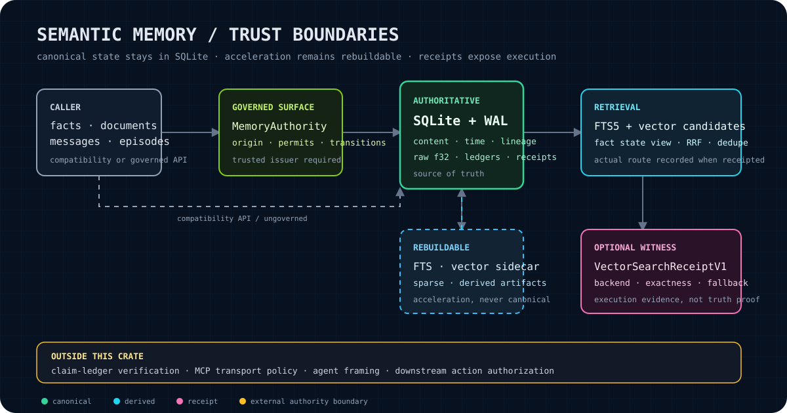
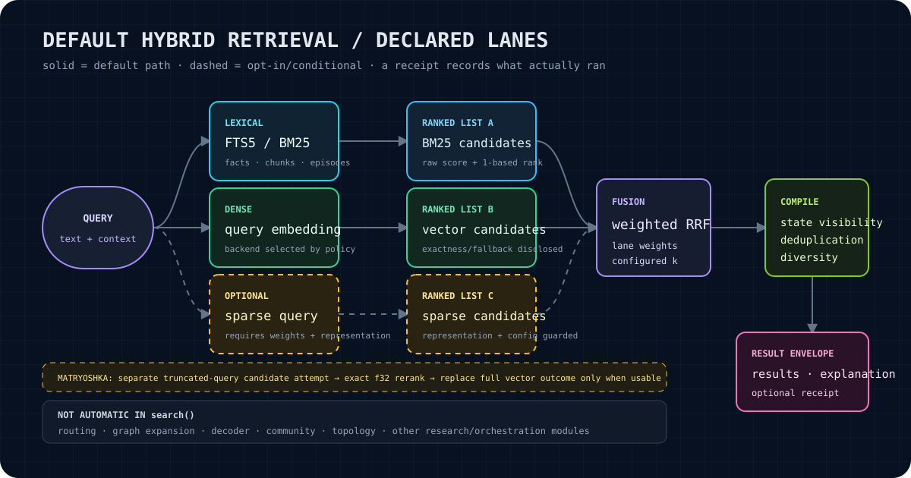
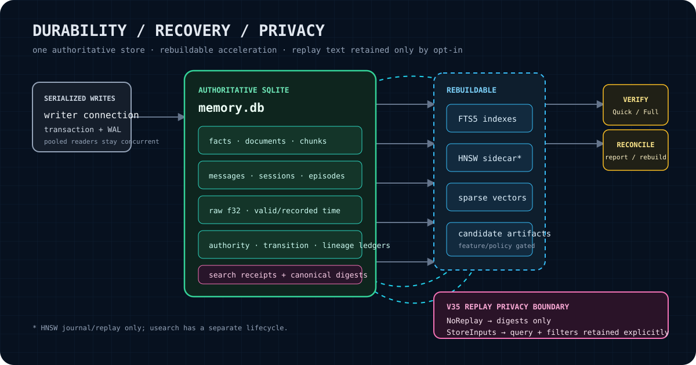
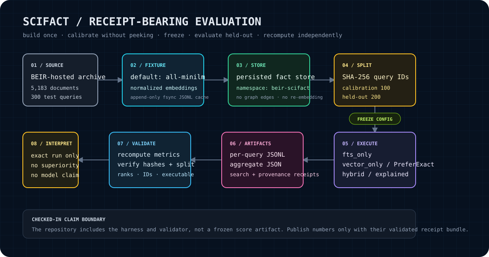

# semantic-memory

Local-first hybrid retrieval for Rust, with SQLite as authoritative state and receipts for execution evidence.



`semantic-memory` stores facts, documents and chunks, conversations, episodes, embeddings, temporal state, authority ledgers, and search receipts in SQLite. FTS indexes, vector sidecars, sparse representations, and compressed candidate artifacts accelerate retrieval; they do not replace canonical state and can be reconciled from SQLite.

> **Status:** research-grade library with a tested default retrieval contract. Feature-gated research and orchestration modules are not implicit guarantees of `MemoryStore::search()` behavior.

| Contract fact | Current value |
| --- | --- |
| Crate version | `0.5.14` |
| Minimum Rust version | `1.75` |
| Default Cargo feature | `usearch-backend` |
| Maximum schema version | `38` |
| License | Apache-2.0 |

## What the crate owns

| Surface | Contract |
| --- | --- |
| Canonical storage | SQLite content, raw f32 embeddings, temporal fields, lineage, authority records, and durable receipts |
| Default retrieval | FTS5/BM25 plus dense-vector candidates, weighted reciprocal-rank fusion, current-state visibility, deduplication, and diversity |
| State semantics | Current, historical, and supersession views for facts, plus separately invoked transition and state-resolution APIs |
| Recovery | Integrity checks and reconciliation from canonical SQLite state |
| Governed mutation | Capability-gated append, supersession, redaction, forgetting, export, and replay through `MemoryStore::authority()` |
| Execution evidence | Optional search receipts that disclose backend, exactness, candidates, fallback, degradation, and result identity |

## What the crate does not own

- **Claim truth.** A search receipt records retrieval execution; it is not a claim-ledger verification decision.
- **Agent action permission.** Recall authority does not grant permission to assert a memory or act on it.
- **MCP transport policy.** See [`semantic-memory-mcp`](https://github.com/RecursiveIntell/semantic-memory-mcp) for transport, tool profiles, and application-level authority composition.
- **Automatic activation of every feature.** Compiling routing, graph, topology, community, decoder, or compression modules does not make the normal search path invoke them.
- **Native SPLADE or native ColBERT.** Dense-derived sparse values and the current late-interaction proxy must not be presented as those systems.

## Install

```toml
[dependencies]
semantic-memory = "0.5.14"
tokio = { version = "1", features = ["macros", "rt"] }
```

The default build enables `usearch-backend`. For an exact pure-Rust backend without the C++ bridge:

```toml
[dependencies]
semantic-memory = { version = "0.5.14", default-features = false, features = ["brute-force"] }
```

## Quick start

This example uses the deterministic `MockEmbedder`, so it needs no network service or downloaded model.

```rust
use semantic_memory::{EmbeddingConfig, MemoryConfig, MemoryStore, MockEmbedder};
use std::path::PathBuf;

#[tokio::main(flavor = "current_thread")]
async fn main() -> Result<(), semantic_memory::MemoryError> {
    let config = MemoryConfig {
        base_dir: PathBuf::from("memory-example"),
        embedding: EmbeddingConfig {
            dimensions: 768,
            ..Default::default()
        },
        ..Default::default()
    };

    let store = MemoryStore::open_with_embedder(
        config,
        Box::new(MockEmbedder::new(768)),
    )?;

    store
        .add_fact("general", "Rust was first released in 2015", None, None)
        .await?;

    let results = store
        .search(
            "when was Rust released",
            Some(5),
            Some(&["general"]),
            None,
        )
        .await?;

    for result in results {
        println!("{:.4} {}", result.score, result.content);
    }

    Ok(())
}
```

`MemoryStore::open()` selects `OllamaEmbedder` unless the crate is compiled with `candle-embedder`, in which case it selects `CandleEmbedder`. Use `open_with_embedder` to inject another provider or a deterministic fixture.

## Choose the retrieval API deliberately

| Need | API | Notes |
| --- | --- | --- |
| Default hybrid retrieval | `search` | Facts, document chunks, and searchable episodes; current state; receipt disabled by default |
| Explicit context and receipt | `search_with_context` | Caller-supplied or wall-clock-initialized evaluation time, receipt/replay mode, exactness profile, request identity, and budgets |
| Historical or superseded view | `search_with_view` | Caller chooses `StateView`; never relabels a current search as historical |
| Lexical only | `search_fts_only` / `search_fts_only_with_context` | No query embedding required |
| Vector only | `search_vector_only` / `search_vector_only_with_context` | Supports `ExactnessProfile::PreferExact` through context |
| Per-lane score evidence | `search_explained` / `search_explained_with_context` | Returns BM25, vector, sparse, and recency fields with RRF contributions; the late-interaction proxy is not separately attributed |
| Conversation retrieval | `search_conversations` | Separate session/message search surface |
| Governed read/search | `MemoryStore::authority()` | Enforces origin and capability contracts independently of relevance score |

Messages are not part of the normal hybrid source set unless selected with `SearchSourceType::Messages`. Conversation search is available separately.

## Default hybrid retrieval contract



The baseline lanes are SQLite FTS5/BM25 and dense-vector retrieval. Their ranked lists are fused with weighted Reciprocal Rank Fusion (RRF). `SearchConfig` controls lane weights, RRF constant, candidate pool size, minimum similarity, result limits, recency behavior, and optional stages.

### Dense retrieval and exactness

The active backend is a runtime fact, not a README promise. When receipts are enabled, `candidate_backend`, `fallback`, `exact_rerank`, candidate counts, and `degradations` report what actually happened.

- `DerivedVectorBackendPolicy::Disabled` selects the non-derived vector policy. With `hnsw` compiled, ordinary search can use HNSW candidates; without that candidate path it uses authoritative SQLite-backed f32 scoring.
- `ExactnessProfile::PreferExact` requests the exact reference path.
- HNSW can supply candidates when the `hnsw` feature is compiled and exactness does not require the reference path.
- TurboQuant and proveKV/poly-kv policies are candidate-only. Their final ranking requires authoritative f32 reranking.
- The default `usearch-backend` feature supplies the public `VectorIndex` implementation; enabling it does not by itself make ordinary `MemoryStore::search()` approximate.
- The `brute-force` feature satisfies the crate's backend feature guard for ordinary exact search; it is not a separate implementation of `VectorIndex::new()`.

### Optional lanes and stages

| Stage | Activation | Boundaries |
| --- | --- | --- |
| Durable sparse | `sparse_weight > 0` plus a usable query sparse representation | Dense-derived sparse is opt-in and is not native SPLADE |
| Matryoshka coarse/full rerank | `matryoshka`, valid `candidate_dims`, compatible reduced-dimension representation, and non-`PreferExact` context | A separate truncated-query candidate attempt may replace the full result only after exact f32 rerank; it is off by default, and not every failed attempt is currently surfaced as a degradation |
| Late interaction | `late-interaction` plus positive weight, when sparse is inactive | The non-HNSW detailed hybrid branch applies a proxy over single dense vectors; it is not persistent token-level ColBERT and is not fused by the HNSW hybrid branch |
| Routing | `routing` feature and explicit application integration | The router can recommend stages; `search*` does not invoke it automatically |
| Recency | Configured half-life and weight | Evaluation-time semantics disable ordinary cache reuse |
| Result compression | Explicit `compress_results` configuration | Compressed text is a derived response projection, not replacement source content |

### Cache boundary

Result caching is intentionally narrow. Only ordinary, unfiltered, current-state searches with default exactness, no receipt, no replay, no request/trace/budget identity, and no recency half-life are cache eligible. Historical, explained, exact, replay-bearing, receipt-bearing, filtered, or governed requests execute independently. Cache entries are also bound to the authority retrieval epoch.

## Durability, recovery, and replay privacy



The store uses SQLite WAL with pooled readers and a serialized writer. Under the `hnsw` feature, pending sidecar operations are journaled and replayed so a committed SQLite write remains authoritative while HNSW synchronization is pending. The default standalone usearch `VectorIndex` does not share that `MemoryStore` HNSW lifecycle.

- `verify_integrity(VerifyMode::Quick | VerifyMode::Full)` reports malformed or drifting state.
- `reconcile(ReconcileAction::ReportOnly | ReconcileAction::RebuildFts | ReconcileAction::ReEmbed)` reports or rebuilds derived state from SQLite.
- Sidecar and derived-artifact failures must not silently become canonical state.
- Search receipts receive canonical BLAKE3 digests when persisted.

### Receipts and replay

```rust
use semantic_memory::{MemoryStore, ReceiptMode, ReplayMode, SearchContext};

async fn replayable_search(store: &MemoryStore) -> Result<(), semantic_memory::MemoryError> {
    let context = SearchContext {
        receipt_mode: ReceiptMode::ReturnReceipt,
        replay_mode: ReplayMode::StoreInputs,
        ..SearchContext::default()
    };

    let response = store
        .search_with_context(
            "when was Rust released",
            Some(5),
            None,
            None,
            context,
        )
        .await?;

    if let Some(receipt) = response.receipt {
        let report = store
            .replay_search_from_stored_inputs(&receipt.receipt_id)
            .await?;
        println!("same result IDs: {}", report.result_ids_match);
    }

    Ok(())
}
```

`ReplayMode::NoReplay` is the default privacy boundary. Query text, namespace filters, and source-type filters are not retained; receipts keep their digests. `ReplayMode::StoreInputs` explicitly retains those inputs in the V35 `replay_inputs` table and enables `replay_search_from_stored_inputs`.

A receipt can establish that a named backend, exactness route, fallback, degradation set, and pre-visibility result identity were recorded. Receipt result IDs are assembled before later `StateView` and forgetting filters, so do not equate them universally with the final governed caller-visible list. A receipt does **not** establish that a result is true, safe to assert, or authorized for downstream action.

## Temporal truth and governed mutation

Normal fact reads use `StateView::Current`, which excludes superseded facts. Historical fact reconstruction is explicit through `StateView` and bitemporal fields. Chunks and messages do not receive an equivalent authority-state filter in the normal hybrid result pass, while episodes and imported projections use their own validity/invalidation handling. If the fact store cannot establish one coherent current head, state-aware resolution fails closed rather than selecting an arbitrary version.

`MemoryStore::authority()` exposes a capability-gated surface for trusted integrations. Governed mutations require an authority permit issued inside the trust boundary; ordinary downstream code is not intended to mint its own authority. The surface covers:

- append and supersession;
- redaction and selective forgetting;
- governed direct reads, search, and graph traversal;
- export and replay;
- immutable origin-authority labels and revocations;
- transition verification, quarantine, and rollback references where declared by the operation.

The compatibility API remains available for ordinary local use. Raw compatibility reads and writes are not equivalent to governed reads: they do not apply the same origin, revocation, scope, purpose, and state decisions. Do not infer a typed transition receipt from a method unless its return contract declares one. Graph utility operations return domain objects and do not universally produce governance receipts.

Hard delete and in-place truth mutation are disabled by default. The `admin-ops` feature exposes administrative operations; use supersession for normal correction workflows.

## Embedding identity and purpose

The committed embedding contract distinguishes `EmbeddingPurpose::Query` from `EmbeddingPurpose::Document`. Query and document text receive different role prefixes, and purpose/profile identity participates in embedding caches and durable dirty-metadata checks. Custom embedders, imported vectors, re-embedding workflows, and benchmark fixtures must preserve that asymmetry or explicitly disclose a different profile.

The SciFact fixture records its own supplied vectors and refuses unknown query text so evaluation cannot silently cross into another embedding provider.

## Cargo features

At least one vector backend (`usearch-backend`, `hnsw`, or `brute-force`) must be enabled.

### Storage, retrieval, and embedding

| Feature | Current effect |
| --- | --- |
| `default` | Enables `usearch-backend` |
| `usearch-backend` | Default public `VectorIndex` implementation through usearch 2.25 |
| `hnsw` | Opt-in legacy `hnsw_rs` candidate backend |
| `brute-force` | Enables ordinary pure-Rust exact f32 search without an ANN dependency; not a standalone `VectorIndex::new()` implementation |
| `candle-embedder` | In-process Candle embedder; changes the `MemoryStore::open()` default |
| `turbo-quant-codec` | TurboQuant derived artifacts and candidate-only policy |
| `poly-kv-codec` | proveKV/poly-kv candidate-only pool policy |
| `matryoshka` | Coarse truncated-embedding candidate stage followed by full rerank |
| `late-interaction` | Late-interaction primitives and the guarded proxy fusion branch |

### Governance and operations

| Feature | Current effect |
| --- | --- |
| `provenance` | Semiring provenance storage |
| `temporal` | Temporal field provenance; depends on `provenance` |
| `subtraction` | Lawful subtraction engine |
| `subgraph-pruning` | Reasoning-subgraph pruning; depends on `subtraction` |
| `compression-governor` | Importance-based compression governance |
| `admin-ops` | Administrative hard-delete and in-place update operations |
| `testing` | Explicitly gated conformance and authority test targets |

### Research and orchestration

| Feature | Current effect |
| --- | --- |
| `routing` | Deterministic query profiling and route recommendations |
| `benchmark` | Routing benchmark harness; depends on `routing` |
| `rl-routing` | Receipt-driven routing-policy persistence; depends on `routing` |
| `multiscale` | Staged multiscale retrieval scheduling |
| `discord` | Second-order graph-neighbor retrieval |
| `decoder` | Contradiction decoder and related analysis |
| `topology` | Persistent-homology/topological analysis |
| `community` | Community detection |
| `integration` | Compile-time bundle of cross-feature modules; not a runtime switch for `search()` |

A feature flag proves that code is compiled, not that a default search request exercised it. Use receipts, explained results, tests, or application-level traces for runtime claims.

## Selected schema milestones, V18–V39

`MAX_SCHEMA_VERSION` is `39`. Migrations are monotonic; compatibility columns can exist even when the corresponding feature-gated Rust API is disabled. This table is intentionally partial. Earlier schema versions remain in the migration ledger, and some versions use procedural Rust migrations rather than a non-empty SQL constant.

| Version | Durable addition |
| ---: | --- |
| V18 | Search receipts |
| V19–V21 | Derived-vector artifacts and generation manifests |
| V22 | Bitemporal episodes |
| V23 | Codec governance |
| V24 | proveKV/poly-kv pool generations |
| V25 | Provenance tables |
| V26 | Temporal score columns |
| V27–V28 | Stored and bitemporal graph edges |
| V29 | Authority state, lineage, and receipts |
| V30 | Transition verification and quarantine |
| V31 | Origin authority and revocations |
| V32 | Selective-forgetting closure |
| V33 | Shadow policies |
| V34 | Procedural memory |
| V35 | Opt-in replay inputs |
| V36 | Sparse vectors and deletion cleanup triggers |
| V37 | Device-owned mutation journal for replication |
| V38 | Replication acknowledgement and stream-epoch state |
| V39 | Verified fact-create receiver: inbox, stream head, and durable duplicate evidence |

Projection-import compatibility APIs are migration surfaces. New integrations should use the current batch-import seam and preserve source export time, transformation time, importer commit time, scope, and temporal fields separately.

## Verified fact-create replication

Semantic-memory owns a transactional fact-create outbox for device-primary
replication (the transport and key admission are owned by caller crates such as
[Mnemes](https://github.com/RecursiveIntell/mnemes)). When a replication
identity is configured at store open, every canonical fact creation — the
ordinary `add_fact` path **and** governed authority appends via
`append_with_metadata` / `verify_and_commit` — writes one verified
`mutation_journal` row through `append_verified_in_tx` in the **same SQLite
transaction** as the fact row, so a failed closure consumes no sequence and no
row is ever visible without its fact.

```rust,ignore
let store = MemoryStore::open_with_embedder(MemoryConfig {
    base_dir: dir.clone(),
    journal_device_id: Some("laptop-1".into()),
    journal_store_id: Some("primary".into()),
    replication_mode: ReplicationMode::FactCreateRequired,
    replication_stream_epoch: 1,
    ..Default::default()
}, Box::new(CandleEmbedder::try_new(&config.embedding)?))?;
```

Outbox rows carry the exact canonical payload (`FactCreatePayloadV1`: fact ID,
namespace, content, source, metadata), a domain-separated digest chain with a
transaction-owned sequence allocator (`replication_streams`), and
`verified_v1` record state. Idempotent retries return the stored receipt
without a second row; the allocator guarantees `1..N` continuity across
restarts. Supersede and redact have no admitted replication contract yet and
intentionally emit no outbox row; stores opened without replication identity
remain local-only.

Verified rows are exported contiguously (`export_verified_contiguous`) and
applied to a fresh replica through the closed receiver
(`apply_verified_fact_create`), which validates the typed envelope, digest
chain, epoch, and stream ordering and returns a durable typed decision
(`Applied` / `Duplicate` / `Fork` / `Gap` / `EpochConflict`).

## Evaluation



The [BEIR SciFact evaluation guide](docs/evaluation/scifact/README.md) runs the checked-in retrieval APIs in three frozen modes:

1. FTS-only;
2. vector-only with `PreferExact`;
3. baseline hybrid with explained results.

The repository includes the builder, runner, independent validator, and tests. It does **not** check in a frozen score artifact, so this README intentionally makes no numeric quality or latency claim. Publish measurements only with the raw per-query JSONL, aggregate receipt, corpus hashes, executable identity, configuration, split definition, and validator result from the same run.

The SciFact harness does not evaluate general-domain quality, graph retrieval, native sparse/SPLADE retrieval, token-level late interaction, Matryoshka quality, or model quality.

## Verification

From the workspace root:

```bash
cargo fmt --package semantic-memory -- --check
cargo check -p semantic-memory --all-targets
cargo test -p semantic-memory --all-targets
cargo clippy -p semantic-memory --all-targets -- -D warnings
```

Backend-specific examples:

```bash
cargo test -p semantic-memory --no-default-features --features brute-force --all-targets
cargo test -p semantic-memory --no-default-features --features hnsw --all-targets --no-run
```

## Examples

| Example | Purpose |
| --- | --- |
| `basic_search.rs` | Minimal fact insertion and hybrid retrieval |
| `conversation_memory.rs` | Session/message persistence and recall |
| `hybrid_retrieval_recall_gate.rs` | Hybrid retrieval with an explicit recall gate |
| `scifact_retrieval_eval.rs` | Receipt-bearing official SciFact evaluation |
| `rebuild_hnsw.rs` | HNSW rebuild flow |
| `real_bench.rs` / `run_bench.rs` | Local benchmark harnesses; results are environment-scoped |
| `turboquant_benchmark_gate.rs` | Candidate-codec benchmark gate |

## Public claim boundary

Defensible from current source and tests:

- local-first SQLite-backed authoritative state;
- rebuildable lexical/vector/sparse/derived projections;
- default hybrid retrieval with explained score components;
- explicit current/historical fact views;
- optional durable search receipts and opt-in replay inputs;
- capability-gated authority APIs and administrative-operation feature gates;
- experimental and feature-gated retrieval/governance modules.

Not established merely by this README or by compiling the crate:

- production certification or secure autonomous administration;
- universal truth verification;
- permission to act on recalled content;
- superiority over other retrieval systems;
- native SPLADE, native ColBERT, or universal lossless compression;
- performance outside a named, reproducible benchmark receipt.
